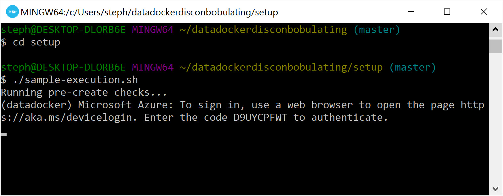

# Data + Docker = Disconbobulating?
> Data should live forever. Docker containers should be constantly killed and reborn. How do you match up these two opposing requirements to do data persistence in a docker environment?

This repo contains setup and demo scripts for Steph Locke's **Data + Docker = Disconbobulating?** talk. Please feel free to fork it, play with it, and hopefully improve it! Pull Requests are welcome :)

## Setup
In the [`setup/`](./setup/) folder, code amended from an [earlier gist](https://gist.github.com/stephlocke/a02d7b8be42604e5b6bbd19d689ab28f) is used to perform setup on Azure. This is a preference not a requirement.

The script installs the Azure file storage plugin to allow us to work with a file storage system that's basically unlimited and taken care of by someone else. 

Once this plugin is installed on our docker-machine it then goes on to create some volumes we can use in our demos. You could alternatively create these on the local machine.

```
# Create azure volumes
docker volume create --name logs -d azurefile -o share=logs
docker volume create --name config -d azurefile -o share=config
docker volume create --name simpledb -d azurefile -o share=simpledb
```

The [sample setup](./setup/sample-execution.sh) shows how you can pass a subscription ID and the name of a config file to the [docker machine setup](./setup/azure-docker-machine.sh). Obviously the sample doesn't work because it has dummy values in it! You'll need to amend with your own values.

You may need to perform a device authentication step, which is pretty simple.


Once completed, you may need to make the new machine the active docker-machine

```
eval $("C:\Program Files\Docker Toolbox\docker-machine.exe" env datadocker)
```

### Cleanup
The nice thing about using Azure and seperate docker-machine is how easy it is to trash it after you're done.

```
docker-machine rm datadocker
```

## Basic writing
This is the sort of scenario where you just need to ship writes, like to a log.

On your docker-machine run

```
docker run -v logs:/logs stephlocke/ddd-simplewrites
```

This kicks off the docker container `stephlocke/ddd-simplewrites` from dockerhub and mounts the volume logs to the container. This overrides the default log volume mentioned in the Dockerfile for this container.

### At volume!
Let's set some of these to constantly kill and recreate themselves

```
docker run --name="docker1" --restart=always -d -v logs:/logs stephlocke/ddd-simplewrites
docker run --name="docker2" --restart=always -d -v logs:/logs stephlocke/ddd-simplewrites
docker run --name="docker3" --restart=always -d -v logs:/logs stephlocke/ddd-simplewrites
```

### Why wouldn't you do this?
The demo is a super simple one. It's not very sensible if you have multiple instances all running at the same time, trying to write to the same file. A sensible person would write to a file named after the instance or pass results to API for it to handle concurrency.