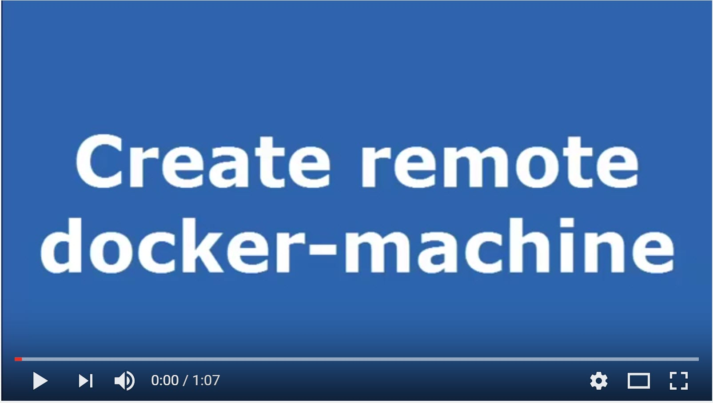

# Data + Docker = Disconbobulating?
> Data should live forever. Docker containers should be constantly killed and reborn. How do you match up these two opposing requirements to do data persistence in a docker environment?

## Contents
- [Data](#data)
- [Docker](#docker)
- [Data + Docker](#data--docker)
- [Demo setup](#setup)
- [Basic demo](#basic-demo)
- [A database](#a-database)
- [DB scale out strategies](#db-scale-out-strategies)
- [Misc info](#misc-info)

## Data
Data is a business' life blood. For some companies, it's their entire value proposition. The generation, access, and retention of data is paramount. This yields a few rules of thumb:

- Never delete, never surrender 
- Change with due consideration
- Keep data safe

We can't just lose data, whether through not keeping it for long enough or through trashing it due to a botched change. We've got to look after it!

## Docker
Docker encapsulates code and saves having to worry quite so much about hardware. It's designed to facilitate scaling of (stateless) code and enable new versions to be rolled out easily. Docker's rules of thumb are very different to data's:

- Never patch
- Containers are cattle, not pets

## Data + Docker
Whenever you kill a container, you lose it's contents so data can't be stored in a container. Does that mean all that fancy schmancy learning and massive scaling you can do with Docker means diddly because it's going to bottle neck on a megalithic database?

Thankfully, Docker containers can connect to external data volumes. This enables us to persist data, without damaging our flexibility available by Docker.

## Setup
In the [`setup/`](./setup/) folder, code amended from an [earlier gist](https://gist.github.com/stephlocke/a02d7b8be42604e5b6bbd19d689ab28f) is used to perform setup on Azure. This is a preference not a requirement.

The script installs the Azure file storage plugin to allow us to work with a file storage system that's basically unlimited and taken care of by someone else. I don't have to worry about hard drive failures and I can encrypt data at rest.

Once this plugin is installed on our docker-machine it then goes on to create some volumes we can use in our demos. You could alternatively create these on the local machine.

```
# Create azure volumes
docker volume create --name logs -d azurefile -o share=logs
docker volume create --name config -d azurefile -o share=config
docker volume create --name simpledb -d azurefile -o share=simpledb
```

The [sample setup](./setup/sample-execution.sh) shows how you can pass a subscription ID and the name of a config file to the [docker machine setup](./setup/azure-docker-machine.sh). Obviously the sample doesn't work because it has dummy values in it! You'll need to amend with your own values, make sure to amend `setup/azurefile-dockervolumedriver` and `setup/sample-execution.sh`

[](https://www.youtube.com/watch?v=d1JrzMSRvM0 "Create and external docker-machine")

You may need to perform a device authentication step, which will depend on cloud provider. Once completed, you may need to make the new machine the active docker-machine

```
eval $("C:\Program Files\Docker Toolbox\docker-machine.exe" env datadocker)
```

### Cleanup
The nice thing about using Azure and seperate docker-machine is how easy it is to trash it after you're done.

```
docker-machine rm datadocker
```

## Basic demo
This is the sort of scenario where you just need to do work a failry simple file system, for instance writing logs.

### Making a write
On your docker-machine run

```
docker run -v logs:/logs stephlocke/ddd-simplewrites
```

This kicks off the docker container [`stephlocke/ddd-simplewrites`](https://hub.docker.com/r/stephlocke/ddd-simplewrites/) from dockerhub and mounts the volume logs to the container. This overrides the default log volume mentioned in the Dockerfile for this container. It then simply writes the hostname to a file.

*See the [Dockerfile](simplewrites/Dockerfile)*

### At volume!
Let's set some of these to constantly kill and recreate themselves in the background.

```
docker run --name="docker1" --restart=always -d -v logs:/logs stephlocke/ddd-simplewrites
docker run --name="docker2" --restart=always -d -v logs:/logs stephlocke/ddd-simplewrites
docker run --name="docker3" --restart=always -d -v logs:/logs stephlocke/ddd-simplewrites
```

### Add a reader

```
docker run -v logs:/logs stephlocke/ddd-simplereads
```

This kicks off the docker container [`stephlocke/ddd-simplereads`](https://hub.docker.com/r/stephlocke/ddd-simplereads/) from dockerhub and mounts the volume logs to the container. This overrides the default log volume mentioned in the Dockerfile for this container. It then simply shows the tail of the file being written to by our containers.

*See the [Dockerfile](simplereads/Dockerfile)*

### Why wouldn't you do this?
The demo is a super simple one. It's not very sensible if you have multiple instances all running at the same time, trying to write to the same file. A sensible person would write to a file named after the instance or pass results to API for it to handle concurrency.

## A database
Let's build a more common scenario: a single database.

Get a docker container up and running. This will initialise database files in the directory.

```
docker run -d -v dbs:/var/lib/mysql -p 6603:3306 --env="MYSQL_ROOT_PASSWORD=mypassword" --name mydb mysql

# docker stop mydb
# docker rm mydb
```

### Attach to existing database files

```
docker run -d -v dbs:/var/lib/mysql -p 6603:3306 --env="MYSQL_ROOT_PASSWORD=mypassword" --name mydb mysql
```

### Nature of locks
MySQL tries to lock files for use. Creating multiple database instances over the same files tends not to work.

```
docker run -d -v dbs:/var/lib/mysql -p 6604:3306 --env="MYSQL_ROOT_PASSWORD=mypassword" --name mydb2 mysql
docker exec -it mydb mysql -u root -p
mysql> show databases;
mysql> create database blah;
mysql> exit
docker ps
docker logs mydb2
```

So this gets us back to our scaling problem as we still have a single database container we'd have to connect to!

## DB scale-out strategies
So a single database is no good. You need to think differently!

1. A database per container - a solution for if data is linked to a customer or some other discrete entity. You could keep their data entirely seperate and attach an app container to it when required
2. A distributed database - pick a database solution and architecture that doesn't take locks the way mysql and most RDBMS do
3. Someone else's solution - use someone else's database i.e. Software-as-a-Service to put the data on systems designed for scaling
4. Doing some clever stuff with existing database solutions like this [Joyent AutoPilot of MySQL](https://www.joyent.com/blog/dbaas-simplicity-no-lock-in)

### Per "something" DBs
Have a file space per customer / group of customers / some of other system and associate containers to these. This would follow from spinning up an application tier per SOMETHING to isolate resources and content. Requires front-end routing in front of instances. Facilitates change roll-out flexibility.

### Distributed data
Use a data storage system that doesn't lock to a single container. This could be something like [Couchbase on Docker](http://blog.couchbase.com/2016/july/docker-services-stack-distributed-application-bundle) via Docker "Service". This would allow a more traditional database connectivity but would self-heal.

### SaaS
Offload the DB! Move things to something like Azure SQL DB, AWS RDS etc to let them handle scaling, storage, redundancy etc. The NOT MY PROBLEM approach might have higher costs long term but has lower implementation considerations. The other design patterns can also be implemented. Will have latency issues if containers are not close to data.

## Misc info
This repo contains Steph Locke's **Data + Docker = Disconbobulating?** talk. Please feel free to fork it, play with it, and hopefully improve it! Pull Requests are welcome :)

### Further reading
- [Joyent on persistent data in docker](https://www.joyent.com/blog/persistent-storage-patterns)

### Licensing
Everything is [licensed under MIT](LICENSE).